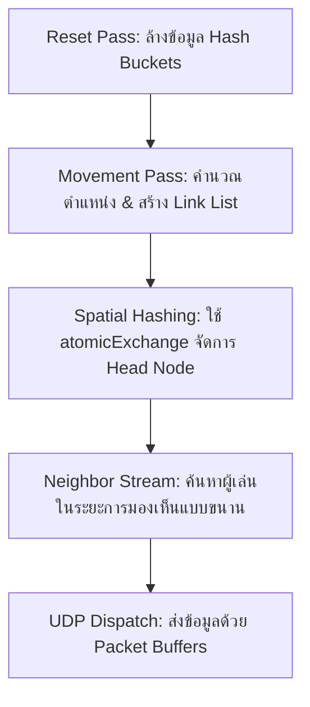

# 🚀 Pure GPU Spatial Hashing Engine

ระบบ Game Server ประสิทธิภาพสูง พัฒนาด้วยภาษา Rust ที่ออกแบบมาเพื่อรองรับผู้เล่นพร้อมกันได้สูงสุดถึง **1,500,000 Player** ที่ความเร็วคงที่ **30 Ticks Per Second (TPS)** โดยเน้นการประมวลผลบน GPU ทั้งหมดเพื่อหาตำแหน่งและการมองเห็นของผู้เล่น (Spatial Partitioning & Neighbor Discovery)

## 💻 ฮาร์ดแวร์ที่ใช้ทดสอบ (Tested Hardware)
- **CPU**: Intel Core Ultra 7 255H (16 Core / 22 Threads)
- **RAM**: DDR5 16 GB (Unified Memory Architecture)
- **GPU**: Intel Arc Graphics (Integrated)

## 📊 ผลการทดสอบการเพิ่มประสิทธิภาพ (Optimization Journey)

| วิธีการ (Methodology) | ความจุ (Players) | การใช้งาน GPU | ความเสถียร / ข้อจำกัด (Bottlenecks) |
| :--- | :--- | :--- | :--- |
| **ขั้นที่ 1**: CPU (16 Core) + Simple Array Loop | 1,000 | 0% | ประสิทธิภาพลดลงแบบ Exponential (O(N²)) |
| **ขั้นที่ 2**: CPU (16 Core) + Hash Grid (9 cells) | 90,000 | 0% | ติดคอขวดที่ความเร็วการเข้าถึง Memory ของ CPU |
| **ขั้นที่ 3**: Hybrid CPU-GPU (CPU Grid, GPU Stream) | 500,000 | 30% | ติดคอขวดที่การส่งข้อมูล (Sync CPU ↔ GPU) |
| **ขั้นที่ 4**: Full GPU + โครงสร้าง Array จองพื้นที่เผื่อ | 500,000 | 100% | กราฟนิ่ง แต่ GPU ทำงานหนักเต็มที่ |
| **ขั้นที่ 5**: Full GPU + Linked List (Optimized Mem) | 900,000 | 70% | **PCIe Bandwidth Limited**: ส่งข้อมูลผ่าน PCIe ไม่ทัน |
| **ขั้นที่ 6**: Full GPU + Linked List (เพิ่ม Padding เยอะ) | 500,000 | 100% | GPU ทำงานหนักเกินไปเพื่อรักษาความเสถียร |
| **ขั้นที่ 7**: Full GPU + Linked List (Onboard GPU) | 900,000 | 70% | **Unified Memory**: ตัดปัญหา PCIe ทำให้กราฟ GPU นิ่ง |
| **ขั้นที่ 8**: Full GPU + L2 Cache Optimized Grid | **1,200,000+** | **70%** | **ประสิทธิภาพสูงสุด (ลุ้นได้ถึง 1.5M)** |

## 🏗️ สถาปัตยกรรมทางเทคนิค (Technical Architecture)

โปรเจคนี้เลือกใช้ **Pure GPU Compute Shaders (WGSL)** ในการจัดการ Logic ของเกมทุกขั้นตอน เพื่อหลีกเลี่ยงการ Copy ข้อมูลระหว่าง CPU และ GPU ที่มีต้นทุนสูง

### แผนผังการทำงาน (Spatial Workflow)


## 🛠️ จุดเด่นของการปรับแต่ง (Key Optimizations)

### 1. Unified Memory vs. PCIe
การรับส่งข้อมูลของผู้เล่นหลักล้านคน (ประมาณ 16MB - 32MB ต่อ Tick) ผ่าน PCIe มักจะเกิดอาการ "GPU รองาน" แต่เมื่อเปลี่ยนมาใช้ **Onboard GPU (Unified Memory)** จะช่วยลด Latency ในการส่งข้อมูล ทำให้ GPU สามารถประมวลผลคน 1.2M ได้อย่างไหลลื่นที่ Load เพียง 70%

### 2. การจัดการ L2 Cache
การจองพื้นที่ Grid แบบ `(player_count * 16 + grid_count * 8)` bytes ถูกคำนวณมาเพื่อให้ข้อมูลสำคัญถูกยกขึ้นไปอยู่บน **L2 Cache** ของ GPU ได้อย่างพอดี ช่วยให้การ `atomicExchange` และ `atomicAdd` ทำงานได้รวดเร็วที่สุด

### 3. โครงสร้าง Grid แบบ Link List
เลือกใช้โครงสร้างข้อมูลแบบ Linked List ภายใน GPU เพื่อประหยัดพื้นที่และรักษาตำแหน่งของข้อมูล (Memory Locality) ให้ข้อมูลที่อยู่ใกล้กันในเกม อยู่ใกล้กันในหน่วยความจำ

## 🚀 วิธีการรันโปรเจค (How to Run)

โปรเจคประกอบด้วย 2 ส่วนหลัก คือตัว **Server (GPU Engine)** และ **Viewer (Client Visualization)**

### 1. การรัน GPU Server (ตัวหลักในการคำนวณ)
ใช้คำสั่งนี้เพื่อเริ่มการประมวลผลตำแหน่งผู้เล่น 1,000,000+ คน บน GPU:
```bash
cargo run --bin gpu
```
*ระบบจะแสดงผล TPS (Ticks Per Second) และ Avg Work(ms) ในหน้า Terminal*

### 2. การรัน Viewer (ดูภาพจำลอง)
รันคำสั่งนี้เพื่อเปิดหน้าต่างดูตำแหน่งการเคลื่อนที่ของผู้เล่นแบบ Real-time:
```bash
cargo run --bin viewer
```
*ตัว Viewer จะรับข้อมูลผ่าน UDP ที่ส่งมาจาก GPU Server*

---
### 🛠️ ความต้องการพื้นฐาน (Requirements)
- **Rust**: ดาวน์โหลดที่ [rustup.rs](https://rustup.rs/)
- **GPU Drivers**: รองรับ Vulkan, DX12 หรือ Metal (มีมาให้ในชิป Intel Core Ultra 7)
- **Networking**: ตัว Server จะเปิด Binding ที่ `127.0.0.1:0` และส่งข้อมูลไปที่ `9000` (Viewer ปลายนิ้ว)

---
*โปรเจคนี้เป็นการวิจัยเชิงลึกเรื่องโครงสร้างพื้นฐานสำหรับเกมออนไลน์ขนาดหยักษ์ (Massive Scale) รับรองความเสถียรที่ 1.2M คน และ Peak ได้สูงสุด 1.5M คน ที่ 30 TPS*
